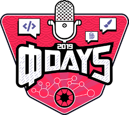
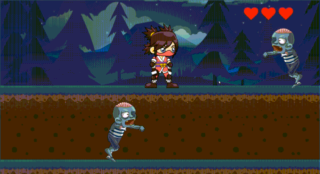
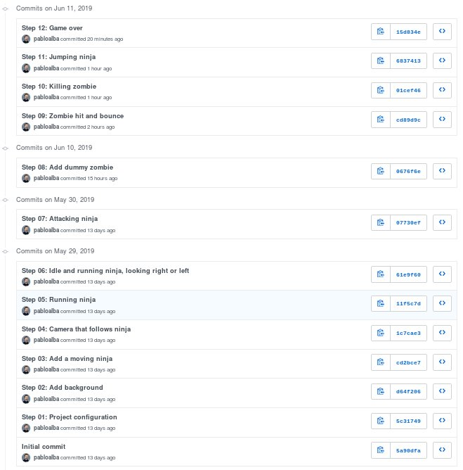
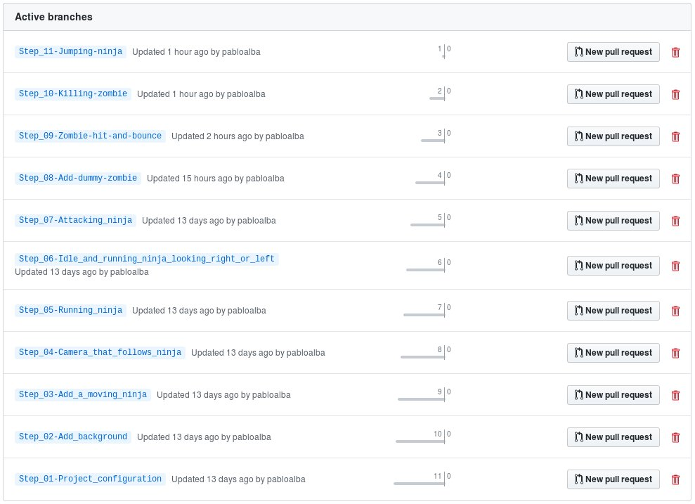
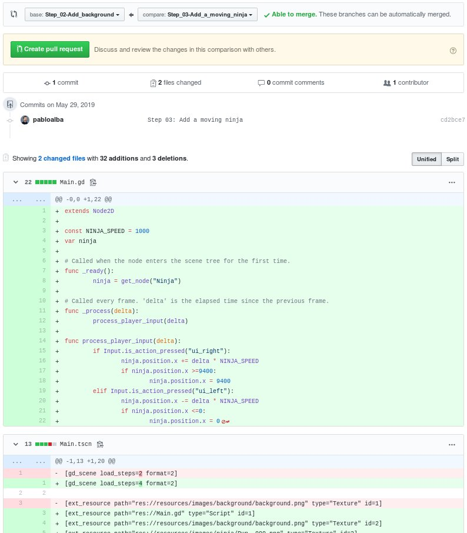

# Ninja girl
This is a [Godot](https://godotengine.org/) tutorial project

Created originaly for the II [Kaleidos](http://kaleidos.net) Phi days





## Overview

The Ninja Girl game is a tutorial for a Godot Workshop. It is a tribute to one of the best beat-em-up games from my childhood: [Bad Dudes Vs. DragonNinja](https://en.wikipedia.org/wiki/Bad_Dudes_Vs._DragonNinja).

The game uses the arrows and space buttons for move the nija, so it is meant to be played with a phisical keyboard.

## Screenshots



## How to use this repo while taking the workshop


The repository has a chain of commits that looks like this:



These commits show every step you'll take to create the app. Each commit is a completed step, and the base for the new one.

Each commit also has a **branch** associated with it of the same name as the commit message, seen below:



Access all branches from 


The branches are also accessible from the drop-down in the "Code" tab


## Working with the Workshop Code

Here are the basic steps for working with the repo.

The basic steps are:

1. Clone the repo
2. Checkout the branch corresponding to the step you want to start from
3. Optionally commit your code changes
3. Compare your code with the solution, that will be on the next branch
6. Repeat steps 2-6 until you've gone trough all the steps to complete the workshop


**Step 1: Clone the repo**

```bash
git clone git@github.com:pabloalba/ninja-girl.git
```

**Step 2: Checkout the step branch**

As you go through different steps in the code, you'll want to check out the branch associated with that step. The command to check out a branch would be:

```bash
git checkout BRANCH_NAME
```


**Step 3: Commit your code changes**

After You've done with the step, you can optionally commit your changes. This will allow you to see the code you wrote whenever you return to the branch. The following git code will add and save **all** your changes.

```bash
git add .
git commit -m "Your commit message"
```

**Step 4: Compare with the solution**

You can make a diff between two branches (or between your code and the target branch) to check the changes.

All of the code that was added in the solution is in green, and the removed code is in red. 

For example, this is a [diff between the Steps 2 and 3](https://github.com/pabloalba/ninja-girl/compare/Step_02-Add_background...Step_03-Add_a_moving_ninja):


## Report Issues
Notice any issues? Please file a github issue.

## Credits and acknowledgment

I will be lost with the visual part of game development, but for the great people that share their art :)

* The [ninja girl](https://www.gameart2d.com/ninja-girl---free-sprites.html) images are from GameArt2d, with the [Creative Common Zero (CC0) a.k.a Public Domain](https://creativecommons.org/publicdomain/zero/1.0/) license.

* The [zombie](https://craftpix.net/freebies/2d-game-zombie-character-free-sprite-pack-1/) and [background](https://craftpix.net/freebies/free-horizontal-2d-game-backgrounds/) images are from Craftpix with the [Freebie] (https://craftpix.net/file-licenses/) license.

* The [game over](https://pixabay.com/photos/game-over-game-over-computer-2720584/) image is from Ryan Morrison with a [pixbay](https://pixabay.com/service/license/) license


